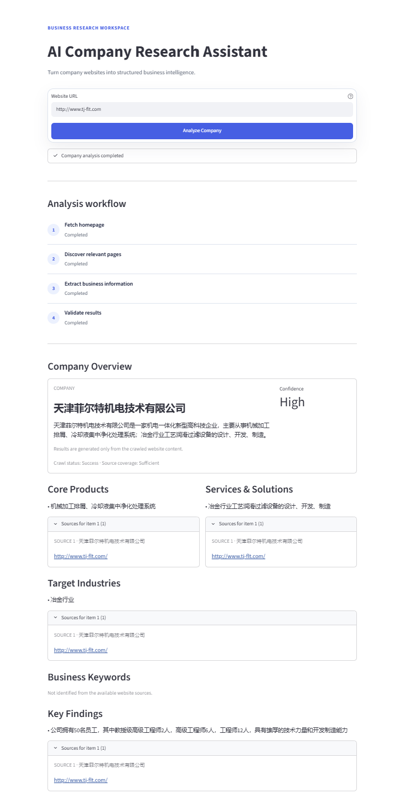

# AI Company Research Assistant

## Project Overview

AI Company Research Assistant is a Streamlit application that turns a company
website into a structured, evidence-linked business research brief.

Rather than sending a website directly to an LLM, the application implements an
end-to-end research workflow:

```text
Website crawling
-> business page discovery
-> content extraction
-> source coverage assessment
-> LLM structured extraction
-> validation
-> evidence attribution
-> human review fallback
```

Every major AI-generated conclusion links back to the exact page supplied to
the model. Weak, unsupported, or invalid results are routed to manual review
instead of being presented as reliable research.

## Business Problem

First-pass company research is often a repetitive manual process: analysts
open a corporate website, search for product and solution pages, extract useful
facts, and organize them into a consistent brief. This is slow, difficult to
standardize, and prone to unsupported assumptions when website coverage is
incomplete.

## Solution

This application accepts a company website URL and performs a bounded four-step
workflow:

1. Fetch the homepage safely.
2. Discover and crawl relevant product, solution, service, business, and about
   pages.
3. Send only the cleaned crawler output to an OpenAI-compatible LLM.
4. Validate the JSON response, confidence level, and source references before
   displaying the result.

The output includes a company overview, products, services and solutions,
target industries, business keywords, key findings, confidence, and supporting
source pages.

## Workflow

```text
Company URL
    |
    v
URL safety checks and homepage fetch
    |
    v
Bounded same-domain page discovery (maximum 10 pages)
    |
    v
Content cleaning and independent source-coverage assessment
    |
    v
Evidence-only LLM extraction
    |
    v
JSON, field, confidence, placeholder, and SOURCE ID validation
    |
    +--> Valid result: display structured research with source links
    |
    +--> Invalid or insufficient result: retry once, then manual review
```

## Key Features

- Discovers business-relevant pages from navigation links, sitemaps,
  `robots.txt`, and a small bounded list of common business paths.
- Extracts cleaned page text, SEO title and description, and image alt text.
- Separates crawler health (`crawl_status`) from evidence sufficiency
  (`source_coverage`). A blocked irrelevant link does not automatically reduce
  the confidence of an otherwise well-supported analysis.
- Supports structured handling for timeouts, HTTP errors, SSL errors,
  anti-bot pages, empty pages, JS-only pages, DNS failures, and unsafe redirects.
- Uses an OpenAI-compatible client configured through environment variables.
- Retries one invalid model response and returns a structured manual-review
  result if validation still fails.
- Preserves the complete list of pages used as model sources.

## Human-in-the-loop Design

The application is designed to assist research rather than replace analyst
judgment.

- Very sparse source content is never sent to the LLM.
- Limited coverage restricts confidence to `medium` or `low`.
- Invalid or repeatedly non-conforming model output is marked
  `manual_review` instead of causing an unhandled error.
- Crawl warnings remain visible so an analyst can distinguish source gaps from
  ordinary page-level failures.
- The interface explicitly reminds users that results are generated only from
  crawled website content.

## Evidence / Source Traceability

Every source passed to the model receives a stable ID for that analysis run:

```text
[SOURCE 3]
Page type: product
URL: https://example.com/products/example
Title: Example Product
Content: ...
[/SOURCE 3]
```

Major conclusions use the following structure:

```json
{
  "text": "Example Product Platform",
  "source_ids": [3]
}
```

The validator rejects missing, empty, duplicate, non-integer, or nonexistent
source IDs. The Streamlit UI keeps the result concise while allowing users to
expand each item and inspect its source title and URL.

## Confidence & Source Coverage

Crawler health and evidence sufficiency are evaluated separately:

- `crawl_status` records whether the crawl completed cleanly or encountered
  page-level warnings and errors.
- `source_coverage` evaluates the number of usable pages, readable content
  volume, availability of business pages, and page-type diversity.
- An irrelevant failed redirect or inaccessible subpage does not automatically
  downgrade otherwise sufficient evidence.
- Limited coverage prevents `high` confidence. Extremely sparse content skips
  the model entirely and returns a manual-review result.

This design makes confidence reflect the available evidence rather than the
mere presence of crawler diagnostics.

## Security and Reliability

- Only HTTP and HTTPS URLs are accepted.
- Localhost, private, loopback, link-local, and cloud metadata addresses are
  blocked.
- Redirect destinations are checked again before content is processed.
- Crawling remains same-domain and is bounded to approximately 10 successful
  pages.
- SSL verification is enabled by default.
- API keys are read at runtime and are never stored in source code.
- Website text is treated as untrusted data and cannot override the analysis
  instructions.

## Tech Stack

- Python 3.10+
- Streamlit
- Beautiful Soup 4
- curl-cffi, with Requests as a fallback HTTP backend
- OpenAI Python client configured for an OpenAI-compatible API
- Python `unittest` for focused helper and validation tests

## Limitations

- The crawler does not render JavaScript and may have limited coverage on
  client-rendered websites.
- Anti-bot systems, authentication, geo-restrictions, or unusual navigation can
  prevent access to some pages.
- Page discovery intentionally favors precision and bounded execution over
  exhaustive crawling.
- Source IDs prove which pages the model cited, but automated validation cannot
  fully establish semantic entailment; important conclusions still require
  human review.
- The quality of the final brief depends on the clarity and completeness of the
  public website content.
- CSV and Excel export are not implemented in the current release.

## Demo



## How to Run Locally

### 1. Create and activate a virtual environment

Windows PowerShell:

```powershell
python -m venv .venv
.\.venv\Scripts\Activate.ps1
```

macOS or Linux:

```bash
python3 -m venv .venv
source .venv/bin/activate
```

### 2. Install dependencies

```bash
python -m pip install -r requirements.txt
```

### 3. Configure the API

Set the required API key in the same terminal used to start Streamlit. Do not
commit the real value.

Windows PowerShell:

```powershell
$env:ZHIPU_API_KEY="replace_with_your_api_key"
```

macOS or Linux:

```bash
export ZHIPU_API_KEY="replace_with_your_api_key"
```

Optional environment variables:

- `LLM_API_URL`: OpenAI-compatible API base URL.
- `LLM_MODEL_NAME`: model name exposed by that API.
- `PROHIBITED_WORDS`: comma-separated terms that should invalidate a response.

`.env.example` documents these settings, but the application does not
automatically load `.env`; export the variables through your shell or deployment
platform.

### 4. Start the application

```bash
streamlit run app.py
```

### 5. Run checks

```bash
python -m py_compile app.py crawler.py llm_analyzer.py config.py
python -m unittest discover -s tests -v
```

## Deployment

### Streamlit Community Cloud

1. Push the public-safe project files to a GitHub repository.
2. Open [Streamlit Community Cloud](https://share.streamlit.io/) and create an
   app from that repository.
3. Select `app.py` as the entrypoint. Python 3.12 matches the release checks
   documented for this project.
4. Open **Advanced settings** and add these top-level secrets:

```toml
ZHIPU_API_KEY = "your_api_key_here"
LLM_API_URL = "https://open.bigmodel.cn/api/paas/v4/"
LLM_MODEL_NAME = "glm-4-flash"
```

Streamlit exposes top-level secrets as environment variables, so this works
with the application's existing `os.getenv()` configuration. Never commit the
real `.streamlit/secrets.toml` file or paste a real key into source code,
README examples, issues, screenshots, or Git history.

Community Cloud installs the pinned Python dependencies from the root-level
`requirements.txt`. This project does not currently require a `packages.txt`
file.

Useful official references:

- [Deploy an app on Streamlit Community Cloud](https://docs.streamlit.io/deploy/streamlit-community-cloud/deploy-your-app/deploy)
- [Manage Community Cloud secrets](https://docs.streamlit.io/deploy/streamlit-community-cloud/deploy-your-app/secrets-management)
- [Declare app dependencies](https://docs.streamlit.io/deploy/streamlit-community-cloud/deploy-your-app/app-dependencies)

## Example Use Cases

- Create a first-pass company brief before a strategy or operations review.
- Collect cited product and solution information for supplier screening.
- Prepare evidence-linked notes for competitor or market landscape research.
- Accelerate account research while preserving a path back to the company's
  own website.

These outputs are research aids, not verified due-diligence reports. Review the
cited pages before making material decisions.

## Project Structure

```text
app.py                         Streamlit interface and workflow presentation
crawler.py                     Safe, bounded crawler and page discovery
llm_analyzer.py                Evidence-only prompting and response validation
config.py                      Environment-based LLM configuration
tests/test_crawler_helpers.py  Focused crawler helper tests
tests/test_llm_validation.py   LLM validation and coverage tests
requirements.txt               Runtime dependencies
.env.example                   Placeholder environment-variable template
```

## Responsible Use

Use the generated brief as a research starting point. Review the cited pages
before using conclusions in strategic, operational, investment, procurement, or
other consequential decisions.
